The shaded band around zero shows the range of changes that are **not statistically significant at the 90% level**. A break in the line indicates missing data (October 2025).

---

## Unemployment Rate, 16+

::: {.panel-tabset}
### 1-Month Change
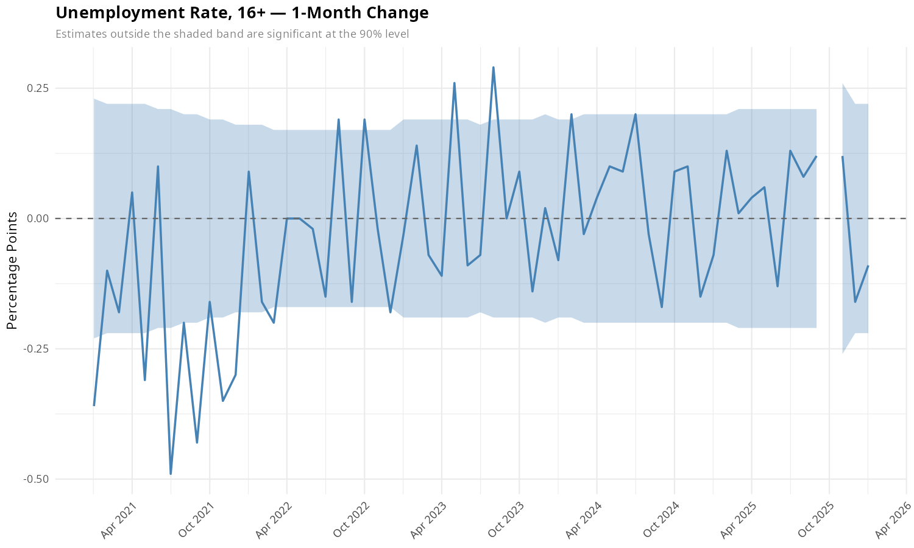{width=100%}

### 3-Month Change
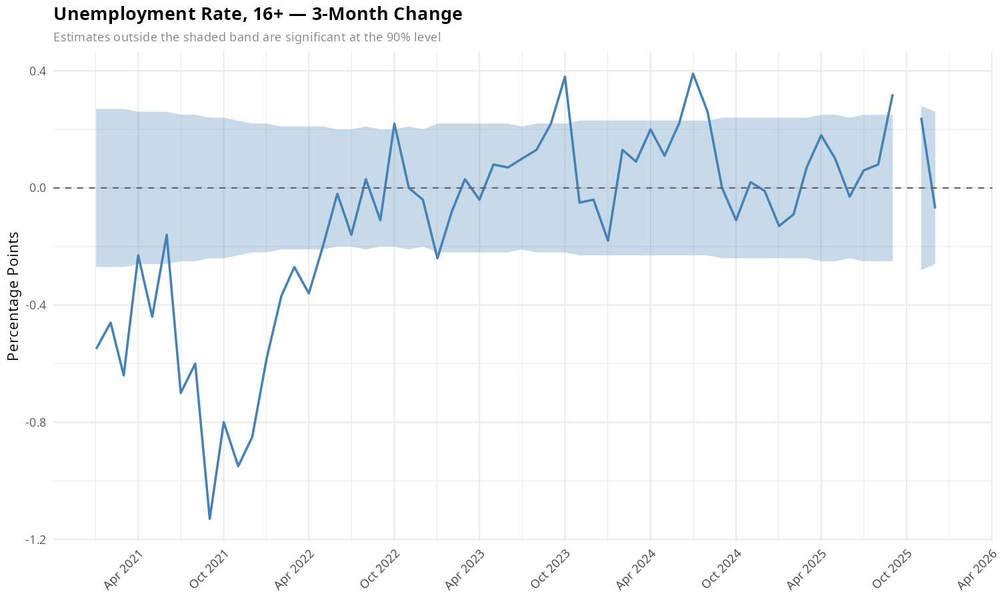{width=100%}

### 6-Month Change
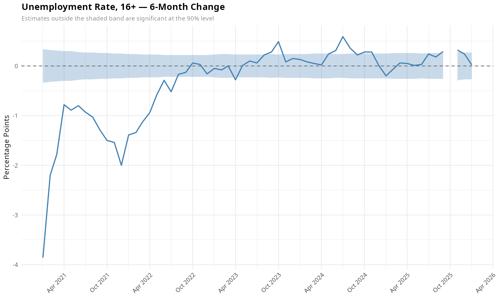{width=100%}

### 12-Month Change
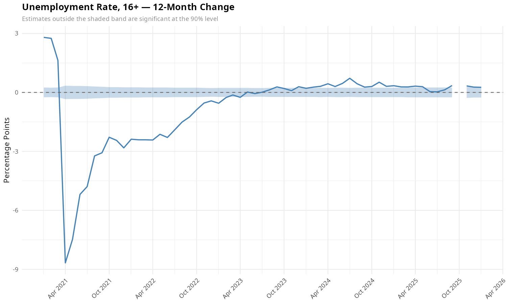{width=100%}
:::

## Unemployment Rate, Black Workers

::: {.panel-tabset}
### 1-Month Change
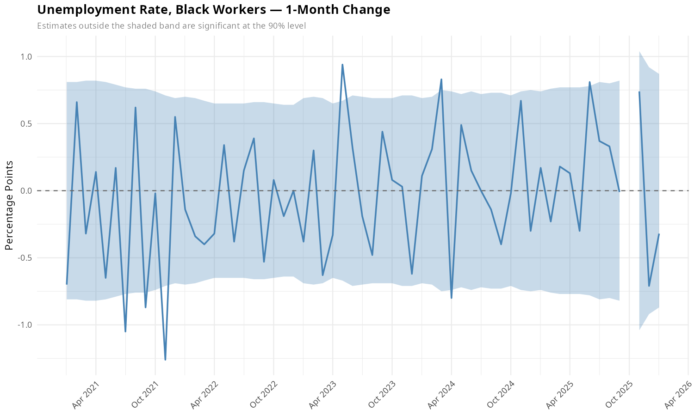{width=100%}

### 3-Month Change
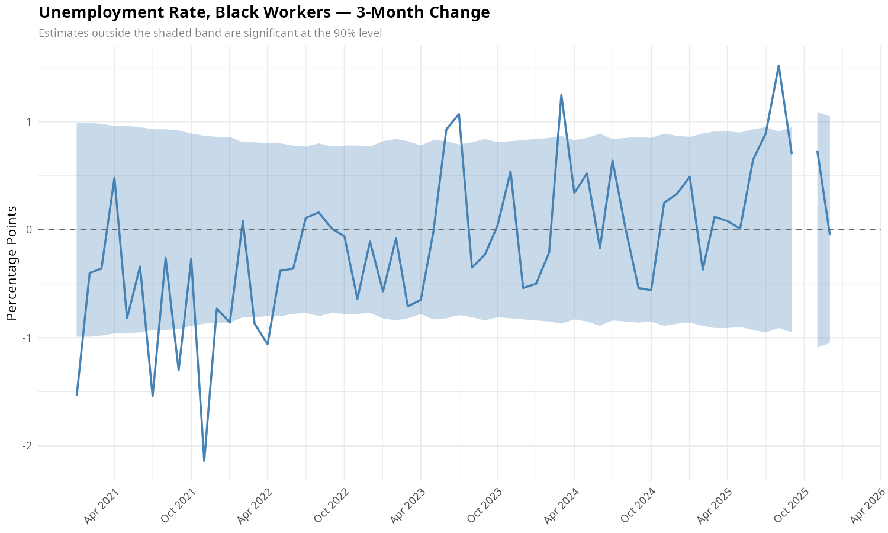{width=100%}

### 6-Month Change
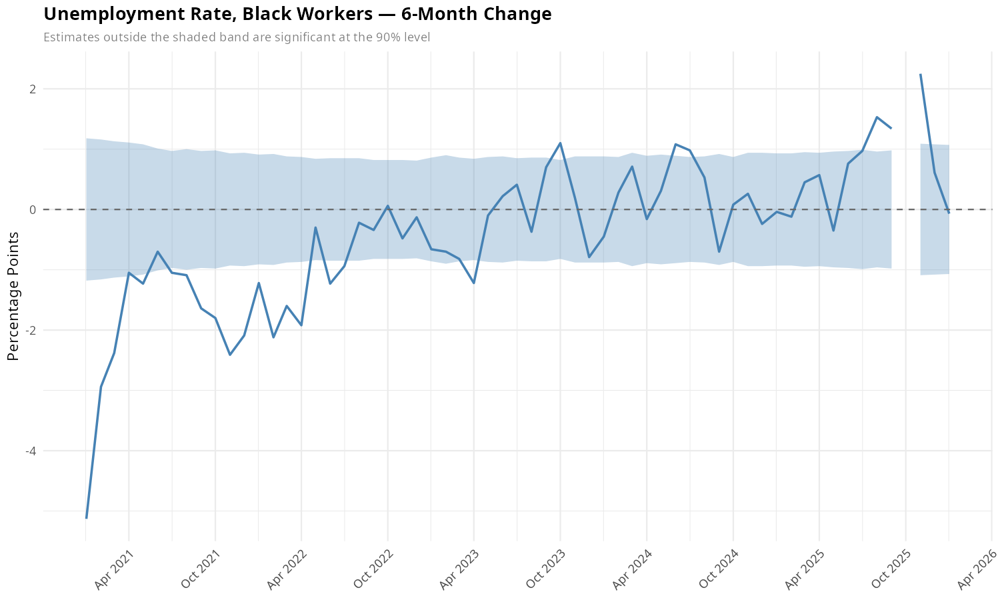{width=100%}

### 12-Month Change
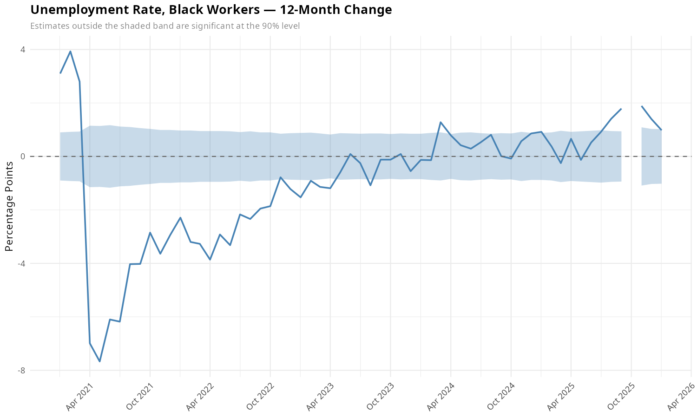{width=100%}
:::

## Unemployment Rate, Teenagers

::: {.panel-tabset}
### 1-Month Change
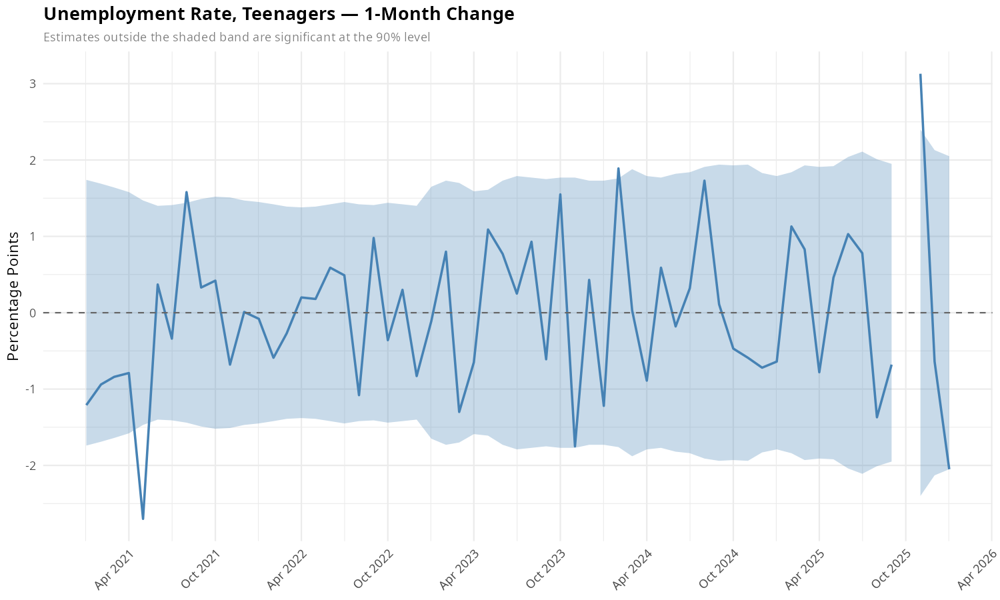{width=100%}

### 3-Month Change
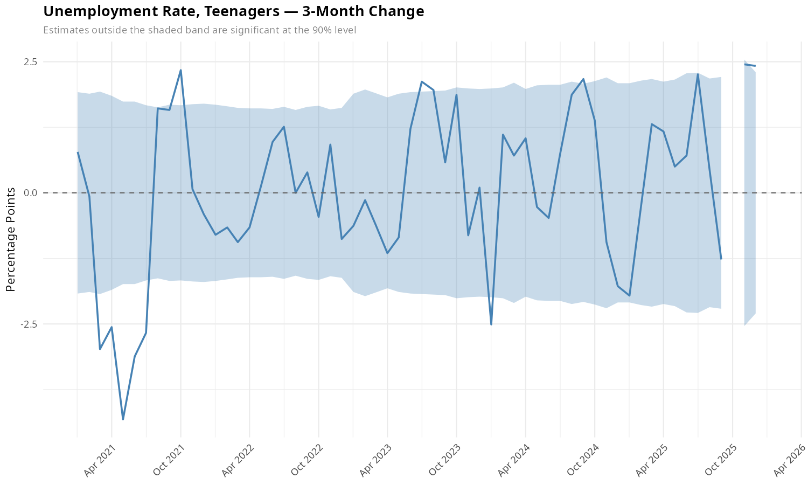{width=100%}

### 6-Month Change
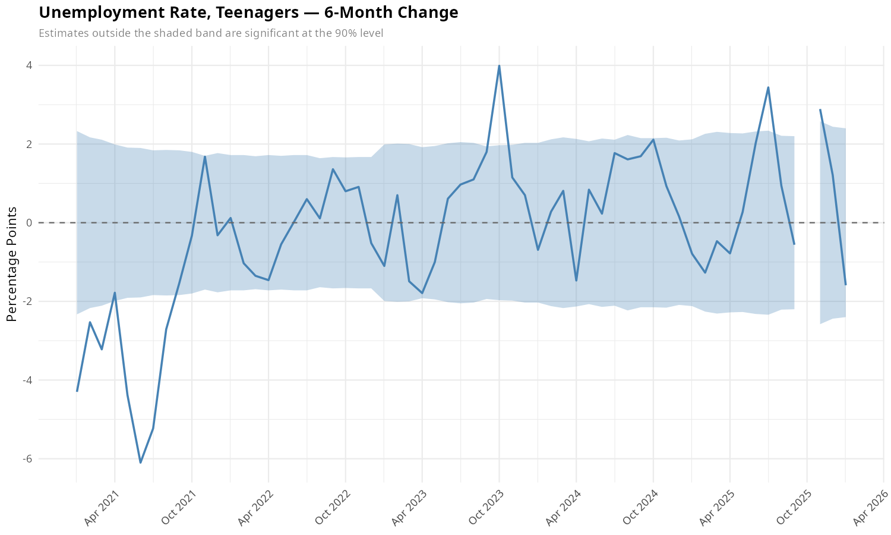{width=100%}

### 12-Month Change
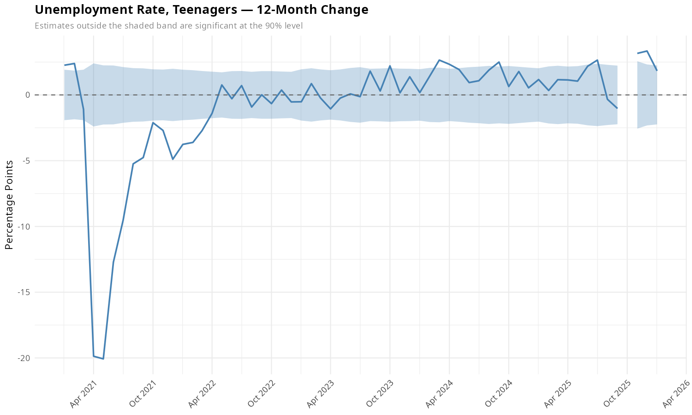{width=100%}
:::

## Long-Term Unemployment (27+ Weeks)

::: {.panel-tabset}
### 1-Month Change
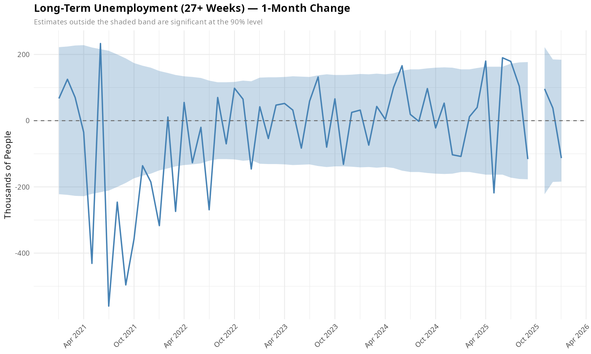{width=100%}

### 3-Month Change
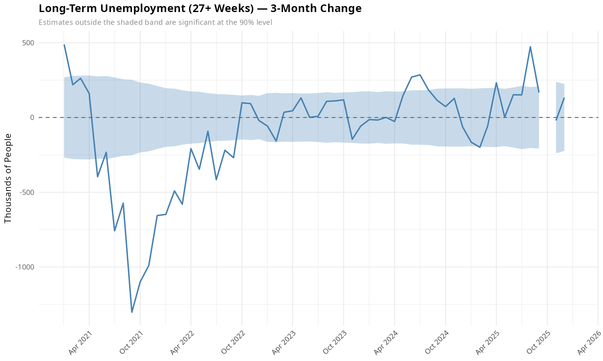{width=100%}

### 6-Month Change
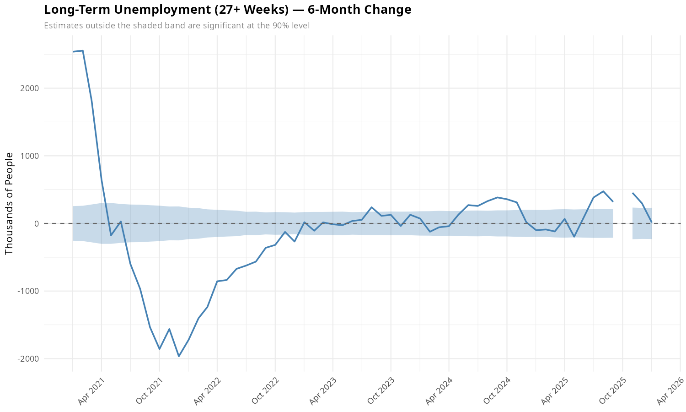{width=100%}

### 12-Month Change
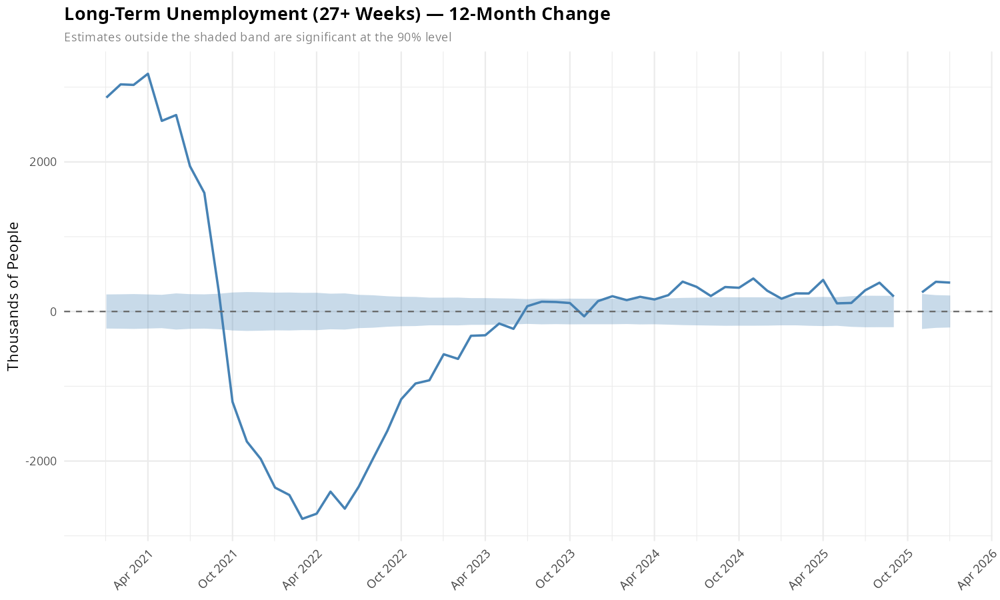{width=100%}
:::
